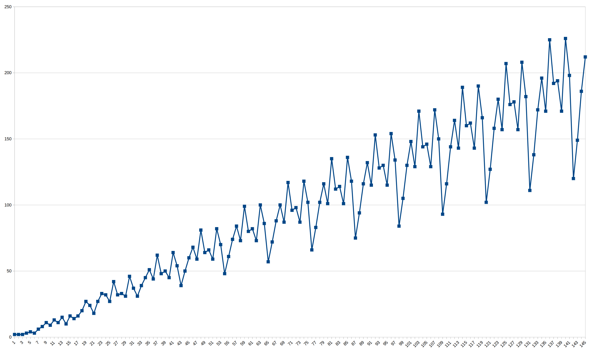

# Day 21

Part 1 is pretty straight forward: Find out which tiles one can reach after 1,
2, 3... iterations and then count the number of tiles.

For Part 2 I had a look at the first 500 results and the deltas to their
predecessors. The first 14 values look something like this for the sample input:

#iteration |   result  |  diff
-----------|-----------|-------
0          |    2      |   2
1          |    4      |   2
2          |    6      |   2
3          |    9      |   3
4          |   13      |   4
5          |   16      |   3
6          |   22      |   6
7          |   30      |   8
8          |   41      |  11
9          |   50      |   9
10         |   63      |  13
11         |   74      |  11
12         |   89      |  15
13         |   99      |  10
...

Plotting the diffs looks like this for the first 150 values:

One can easily see the repeating pattern. After a closer look (at some chart
tooltips) it's easy to see that this pattern starts with total `steps = 42` with a cycle
length of 11. Each of the values within the cycle increases by a constant
number:

diff #cycle  |   diff #cycle+1   |    diff of both diffs
-------------|-------------------|----------------------
 39          |    48             |     9
 50          |    61             |    11
 60          |    74             |    14
 68          |    84             |    16
 59          |    73             |    14
 81          |    99             |    18
 64          |    80             |    16
 66          |    82             |    16
 59          |    73             |    14
 82          |   100             |    18
 70          |    86             |    16
 48          |    57             |     9
 61          |    72             |    11
 74          |    88             |    14
 84          |   100             |    16
 73          |    87             |    14
 99          |   117             |    18
 80          |    96             |    16
 82          |    98             |    16
 73          |    87             |    14
100          |   118             |    18
 86          |   102             |    16

For my real input (and most likely other inputs as well) the offset, cycle
length and actual diff numbers will be different, of course, but can be
determined the same way. Using this information all that's left to do is
calculate all the diffs for 1 step, 2 steps, ... etc. (see `diff_at()`) and sum
up each diff for the number of tiles one can reach after 26501365 steps (see
[solve_part2(), line
145ff.](https://github.com/migerh/aoc-2023/blob/main/src/day21/mod.rs#L148)).
